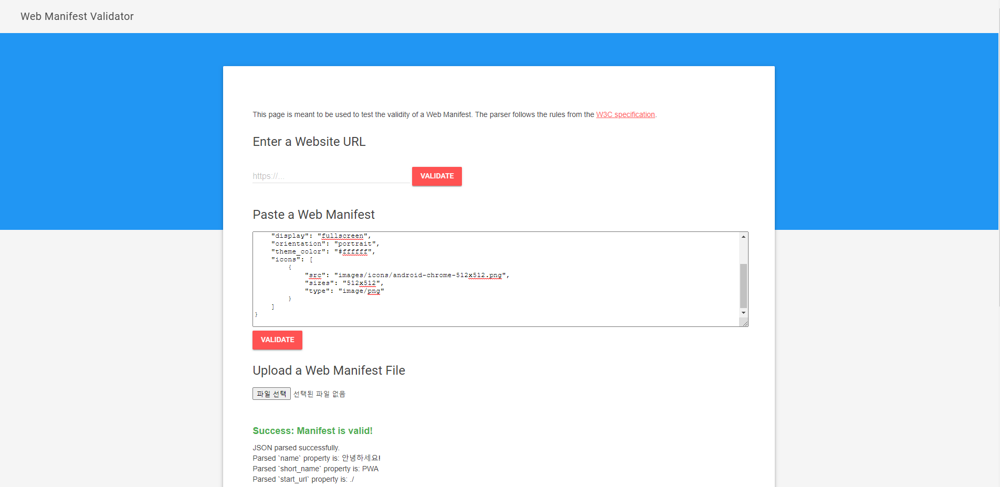

# PWA Training

## 참고 사이트

### [manifest.json 유효성 검사 사이트](https://manifest-validator.appspot.com/)



### [service worker를 지원하는지 검사하는 사이트](https://mobilehtml5.org/tests/sw)


### 디자인 사이트

1. [머터리얼 디자인 공식 웹사이트](material.io/icons)
2. **[폰트어섬](fontawesome.com/icons) 👍**
3. [머터리얼 디자인 아이콘](materialdesignicons.com)


## About Vue

### 머스태시와 v-bind 차이점

1. **머스태시** : HTML 엘리먼트값

```vue
<p>
    {{ sTitle }}
</p>
```

2. **v-bind** : HTML 어트리뷰트 값

```vue
<input v-bind:value="sDate">
```

### v-bind와 v-model 차이점

1. **v-bind** : sDate값을 HTML 어트리뷰트에 보내기만 함

```vue
<input v-bind:value="sDate">
```

2. **v-modle** : sMsg값과 입력값이 서로 연동

```vue
<input v-mode:value="sMsg">
```

### `computed`속성과 `methods`속성 차이점

1. **computed** : 머스태시를 확정할 때 사용
    - 머스태시에 작성할 로직이 복잡해서 함수로 정의할 때
    - 계산량이 많아 캐시가 필요할 때

```vue
<div id="main">
    <p>원본 문장 : "{{ sOriginalMessage }}"</p>
    <p>대문자로 변환된 문장 : "{{ fnUpperCaseMsg }}"</p>
</div>
<script>
//  Vue 객체를 생성해 앱을 초기화하고 시작
new Vue({
    // id 선택자인 main의 div 엘리먼트와 앱을 연결해서 구동
    el: "#main",
    data: {
        sOriginalMessage: "how are you?",
    },
    computed: {
        fnUpperCaseMsg: function () {
            return this.sOriginalMessage.toUpperCase();
        },
    },
});
</script>
```

2. **methods** : 이벤트 핸들러에 사용
    - 뷰의 이벤트 핸들러 로직을 함수로 정의할 때

```vue
<div id="main">
    <h1>{{ sTitle }}</h1>
    <buton v-on:click="fnChangeTitle">눌러주세요</buton>
</div>
<script>
//  Vue 객체를 생성해 앱을 초기화하고 시작
new Vue({
    // id 선택자인 main의 div 엘리먼트와 앱을 연결해서 구동
    el: "#main",
    data: {
        sTitle: "안녕하세요",
    },
    methods: {
        fnChangeTitle() {
            this.sTitle = "Hello!";
        },
    },
});
</script>
```

#### 비교(`computed` vs `methods`)

```vue
<div id="main">
    <p>클릭 숫자 : {{ nClicks }}</p>
    <p>카운트 다운 : {{fnCounter }}</p>
    <button v-on:click="fnIncrement">눌러주세요</button>
</div>
<script>
//  Vue 객체를 생성해 앱을 초기화하고 시작
new Vue({
    // id 선택자인 main의 div 엘리먼트와 앱을 연결해서 구동
    el: "#main",
    data: {
        nClicks: 0,
    },
    computed: {
        fnCounter() {
            return 10 - this.nClicks;
        },
    },
    methods: {
        fnIncrement() {
            this.nClicks++;
        },
    },
});
</script>
```

### 컴포넌트

-   자신만의 엘리먼트를 만들어 쓰는 모듈을 의미
-   컴포넌트에서 `data`속성을 사용할 때는 반드시 함수로 사용

```vue
<script>
Vue.component("my-element", {
    data: function () {
        return {
            strHello: "안녕하세요",
        };
    },
    template: `<h1>{{ strHello }}</h1>`,
});
</script>
```

### 컴포넌트 속성 props

-   component를 head 태그에서 먼저 등록

```vue
<!DOCTYPE html>
<html>
    <head>
        <meta charset="UTF-8" />
        <title>Hello Vue</title>
        <!-- vue CDN에 연결 -->
        <script src="https://cdn.jsdelivr.net/npm/vue"></script>
        <script>
            Vue.component("favorite-fruits", {
                props: ["fruit"],
                template: `<li>{{ fruit.text }} </li>`,
            });
        </script>
    </head>
    <body>
        <div id="app">
            <h1>좋아하는 과일!</h1>
            <ol>
                <favorite-fruits v-for="item in aFruits" v-bind:fruit="item" v-bind:key="item.id"></favorite-fruits>
            </ol>
        </div>
        <script>
            //  Vue 객체를 생성해 앱을 초기화하고 시작
            var app = new Vue({
                // id 선택자인 main의 div 엘리먼트와 앱을 연결해서 구동
                el: "#app",
                data: {
                    aFruits: [
                        { id: 0, text: "사과" },
                        { id: 1, text: "오렌지" },
                        { id: 2, text: "수박" },
                    ],
                },
            });
        </script>
    </body>
</html>
```

### 상태값 관리와 Vuex(store)

#### 1. state

-   공유한 상태값 데이터 정의

#### 2. mutations

-   setters의 의미
-   외부에서 동기 방식으로 저장할 때 사용

#### 3. getters

-   state의 데이터값을 외부에서 읽어올 때 사용

#### 4. actions

-   외부의 API 실행같은 비동기 실행을 관리할 때 사용

```vue
<script>
const store = new Vuex.Store({
    state: {
        count: 0,
    },
    mutations: {
        fnIncData: function (state) {
            return state.count++;
        },
        fnDecData: (state) => state.count--,
    },
    getters: {
        fnGetData(state) {
            return state.count;
        },
    },
    actions: {
        // 상태값을 감소시키는 함수는 서버에서 실행한다고 가정
        // 비동기 실행을 위해 async를 사용하고 매개변수로 commit 객체 전달
        async fnDecData({ commit }, state) {
            const result = await api.fnDecrement();
            if (result === true) commit("fnDecData");
        },
    },
});
// 타이머를 사용해 1초 후 성공 Promise를 반환하도록 가상의 서버 API 정의
const api = {
    fnDecrement() {
        /*
                                비동기 계산을 수행하기 위해 Promise를 사용하고
                                그에 따른 성공값을 반환하기 위해 resolve 함수 실행
                            */
        return new Promise((resolve) => {
            setTimeout(() => {
                resolve(true);
            }, 1000); // 서버 느낌을 내기위한 1초
        });
    },
};

Vue.component("com-counter", {
    props: ["msg"],
    template: `
                            <div>
                                <h2>{{ msg }}</h2>
                                <p>카운터 : {{ fnGetCount }}</p>
                                <button @click="fnIncCount">+1증가</button>
                                <button @click="fnDecCount">-1증가</button>
                                <hr>
                            </div>
                        `,
    computed: {
        fnGetCount() {
            return store.getters.fnGetData;
        },
    },
    methods: {
        // store의 mutations에 직접 접근
        fnIncCount() {
            store.commit("fnIncData");
        },
        // actions에 접근하여 실행
        fnDecCount() {
            store.dispatch("fnDecData");
        },
    },
});
var gApp = new Vue({
    el: "#app",
    // store 선언
    store,
});
</script>
```


## Vue Cli

### 프로젝트 생성

```
vue create example_project
```


### 프로젝트 옵션

| 질문                                       | 참고                                                    |
| ------------------------------------------ | ------------------------------------------------------- |
| Please pick a preset                       | 신규 템플릿을 기본으로 할지 사용자 정의로 할지 결정     |
| Check the features needed for your project | Babel, typescript, PWA 등 다양한 기능으로 선택 가능     |
| Use history mode for router                | 라우터에서 히스토리 모드 사용 여부 결정                 |
| Where do you prefer placing config...      | 설정값을 confg 파일과 package.json 중 어디서 할지 결정  |
| Save this preset                           | 지금까지 선택값을 나중에 재활용할 수 있게 저장할지 결정 |


## 뷰티파이

### 1. 타이포그래피 설정 옵션

 


### 2. 엘리먼트 여백 설정 옵션

 

- ex) .mt-3 : 바깥쪽 여백, top, 16px


### 3. 로렘픽숨

: 빈 공간을 보여주는 대신 임의의 이미지를 규격에 맞게 표시하는 것

- 사용방법 : picsum.photos/사진id/높이/너비/옵션

```vue
<v-card max-width="400">
    <v-img src="https://picsum.photos/id/1068/400/300" aspect-ratio="2.3"></v-img>
</v-card>
```

- `aspect-ratio` : 이미지의 가로:높이 비율에 맞춰서 자를 수 있다.


### 4. 텍스트 정렬

```
text-코드명-정렬명
```

- 코드명 : xs, sm, md, lg, xl
- 정렬명 : left, center, right

 

> 기기별 정렬 옵션에서 중요한 것은 코드명이다.
>
> `text-sm-center`는 600~959 범위에 들어올때만 가운데 정렬이 적용된다.
>
> 그래서 `text-center`같이 코드명을 생략하면 모든 범위에서 가운데 정렬이 적용된다.


### 5. 반응형 그리드

```vue
 <v-row>
     <v-col cols="12" sm="6">
         <h2 class="mb-3">About Beetle</h2>
         <p>운동화는 나를 표현하는 하나의 방법이자 패션을 완성하는 필수템이다.</p>
     </v-col>
     <v-col cols="12" sm="6">
         <h2 class="mb-3">Beetle's Target</h2>
         <p>1. 운동화에 관심있는 사람은 누구나</p>
         <p>1. 운동화에 관심있는 사람은 누구나</p>
         <p>1. 운동화에 관심있는 사람은 누구나</p>
         <p>1. 운동화에 관심있는 사람은 누구나</p>
     </v-col>
</v-row>
```

> `<v-col cols="12" sm="6">` 는 `xs`일 때는 열을 12개 사용하고 `sm`일 때는 열을 6개 사용한다는 의미

#### sm, xs일때 비교

 

